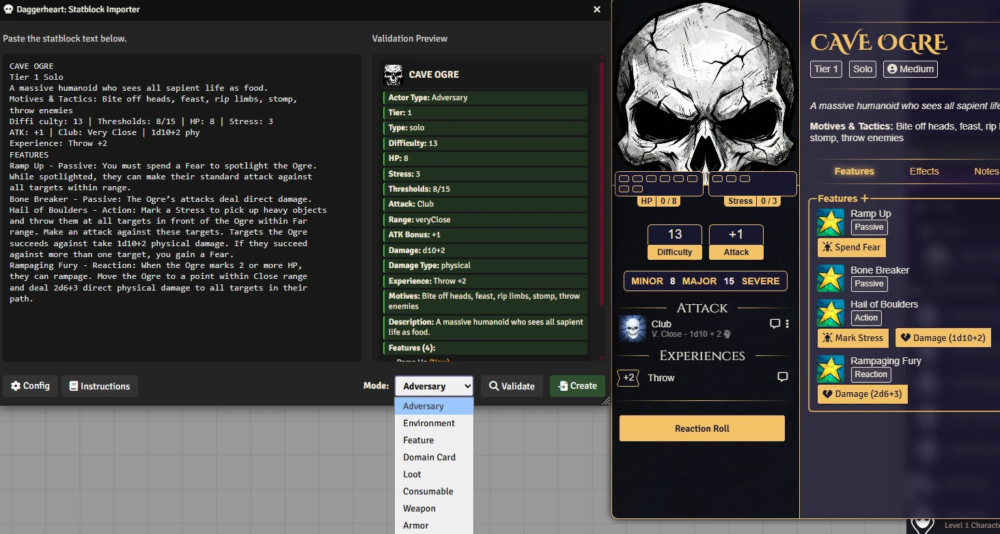
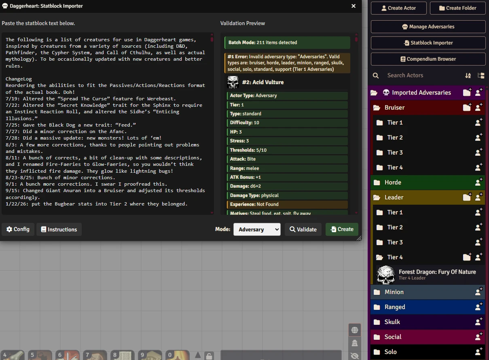
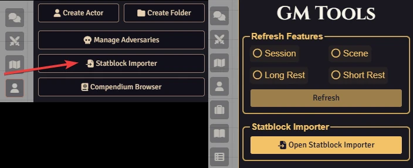
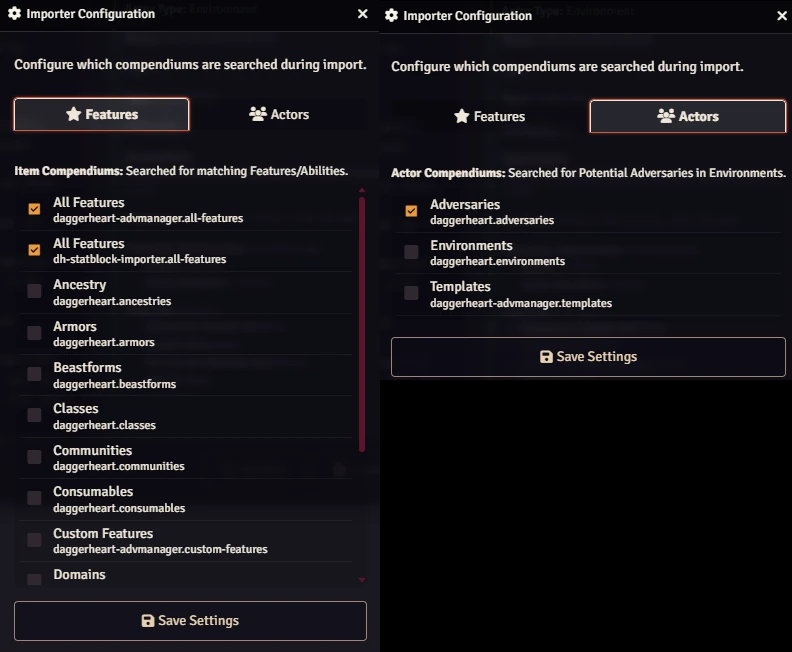

# Statblock Importer
**for Daggerheart**

<p align="center"></p>

Effortlessly import **Adversaries** and **Environments** and **more** into Foundry VTT by pasting text statblocks. This module parses raw text, detects stats, links features from compendiums, and creates actors instantly.

<p align="center"></p>

## 🌟 Overview & Features

### 🛠️ Smart Parsing

* **Adversaries:** Automatically detects Tier, Type, Difficulty, HP, Stress, Thresholds, Attack (Bonus, Name, Range, Damage), Experiences and Features.

* **Environments:** Detects Impulses, Difficulty, and Potential Adversaries.

* **Weapons, Armors, Loot, Consumables, Domain Cards or Features:** You can easily add a lot of different content.

* **Mass Import:** You can paste how many statblocks you want.

### 🔍 Advanced Lookups

* **Feature Linking:** Checks your configured Compendiums for existing features.

* **Potential Adversaries:** Identifies actor groups in Environments and links them to actors in your compendiums.

### ✅ Validation & Organization

* **Real-time Preview:** Verify parsed data before creating the entity.

* **Visual Feedback:** Clearly see which features are new and which are linked from Compendiums.

* **Organized in Folders:** Imports are automatically organized into folders.

<p align="center"></p>

## ⚙️ Usage

1. **Open the Importer:** You can use the button in Daggerheart Menu or Actors directory. You can also use the macro command:

   ```
   SI.Open();   
   ```

<p align="center"></p>

2. **Paste Text:** Copy the statblock text from a PDF or document and paste it into the left panel. You can paste as many as you want.

3. **Validate:** Click "Validate" to preview the data.

4. **Create:** Click "Create" to generate the entity (Adversary, Environment, Weapon, Armor, Loot, Consumable, Domain Card or Feature).

### ⚙️ Configuration

Click the **Config** button in the importer window to select which Compendiums should be searched for **Features** and **Potential Adversaries**.

<p align="center"></p>

## 📚 Formatting Guide

For the best results, ensure your text follows the recommended format.

📖 [**Read the Formatting Wiki**](https://github.com/brunocalado/dh-statblock-importer/wiki)

📖 [**How to Use Unformatted Stats**](https://github.com/brunocalado/dh-statblock-importer/wiki/How-to-Use-Unformatted-Stats)


## 🚀 Installation

Install via the Foundry VTT Module browser or use this manifest link:

```
https://raw.githubusercontent.com/brunocalado/dh-statblock-importer/main/module.json
```

## 📜 Changelog

You can read the full history of changes in the [CHANGELOG](CHANGELOG.md).

## ⚖️ Credits and License

* **Code License:** MIT License.

* **Assets:** AI Audio and images provided are [CC0 1.0 Universal Public Domain](https://creativecommons.org/publicdomain/zero/1.0/).

**Disclaimer:** This module is an independent creation and is not affiliated with Darrington Press.

# 🧰 My Daggerheart Modules

| Module | Description |
| :--- | :--- |
| 💀 [**Adversary Manager**](https://github.com/brunocalado/daggerheart-advmanager) | Scale adversaries instantly and build balanced encounters in Foundry VTT. |
| ☠️ [**Death Moves**](https://github.com/brunocalado/daggerheart-death-moves) | Enhances the Death Move moment with immersive audio and visual effects. |
| 📏 [**Distances**](https://github.com/brunocalado/daggerheart-distances) | Visualizes combat ranges with customizable rings and hover calculations. |
| 🤖 [**Fear Macros**](https://github.com/brunocalado/daggerheart-fear-macros) | Automatically executes macros when the Fear resource is changed. |
| 😱 [**Fear Tracker**](https://github.com/brunocalado/daggerheart-fear-tracker) | Adds an animated slider bar with configurable fear tokens to the UI. |
| 🎲 [**Stats**](https://github.com/brunocalado/daggerheart-stats) | Tracks dice rolls from GM and Players. |
| 🧠 [**Statblock Importer**](https://github.com/brunocalado/dh-statblock-importer) | Import using a statblock. |
| 🛒 [**Store**](https://github.com/brunocalado/daggerheart-store) | A dynamic, interactive, and fully configurable store for Foundry VTT. |
| 📦 [**Extra Content**](https://github.com/brunocalado/daggerheart-extra-content) | Homebrew for Daggerheart. |
| ⚡ [**Quick Actions**](https://github.com/brunocalado/daggerheart-quickactions) | Quick access to common mechanics like Falling Damage, Downtime, etc. |
| 📜 [**Quick Rules**](https://github.com/brunocalado/daggerheart-quickrules) | Fast and accessible reference guide for the core rules. |

# 🗺️ Adventures

| Adventure | Description |
| :--- | :--- |
| ✨ [**I Wish**](https://github.com/brunocalado/i-wish-daggerheart-adventure) | A wealthy merchant is cursed; one final expedition may be the only hope. |
| 💣 [**Suicide Squad**](https://github.com/brunocalado/suicide-squad-daggerheart-adventure) | Criminals forced to serve a ruthless master in a land on the brink of war. |